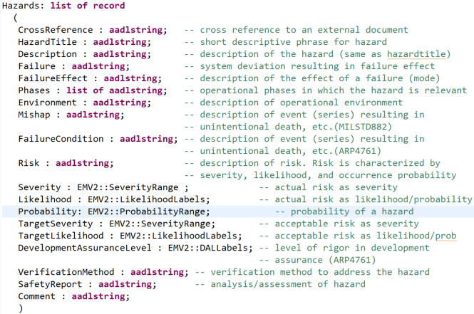
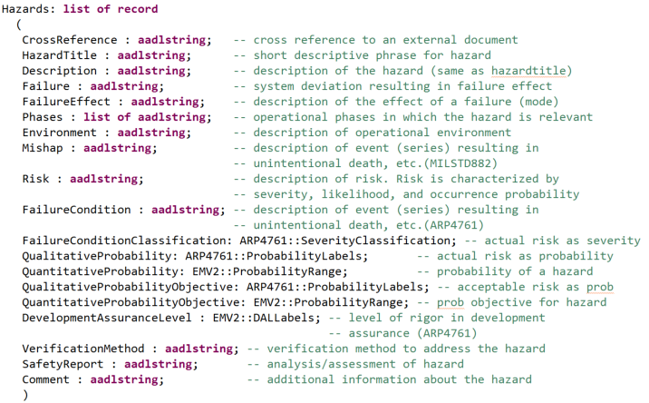
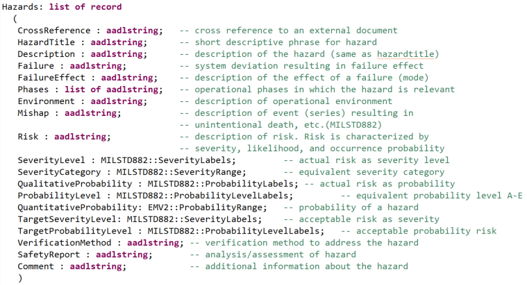
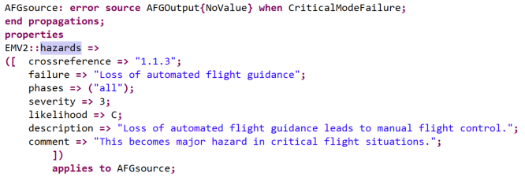
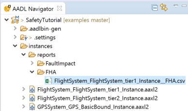
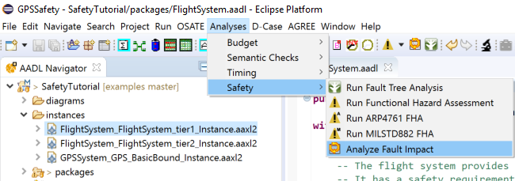
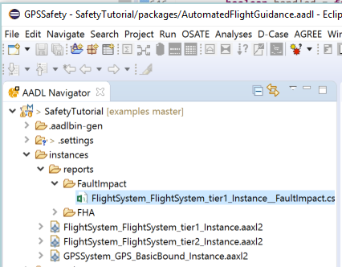
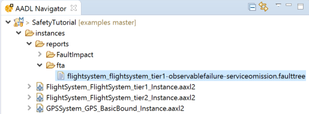
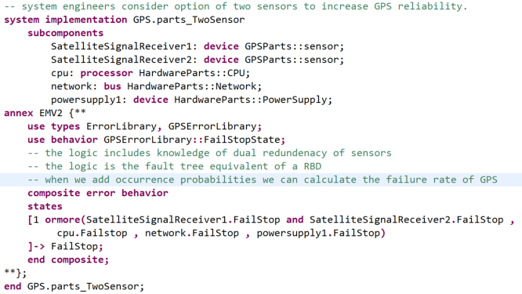
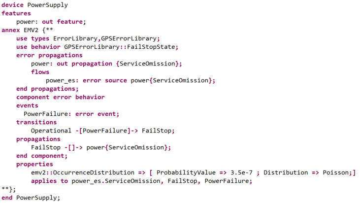

# Safety Analysis with Error Model V2

## Introduction
In this write-up, we demonstrate on an example how functional ahazard asessment (FHA), fault impact analysis (FMEA like), and fault tree analysis (FTA) of a safety-critical system can be performed through the use of AADL, Error Model V2 (EMV2), and the analysis capabilities of OSATE. 

In fault impact analysis the impact of fault occurrences on a system is determined through forward reasoning from an error source. One such form of inductive impact analysis is known as failure mode and effect analysis (FMEA). In OSATE it is supported by a Fault Impact Analysis capability.

In fault tree analysis fault occurrences are identified as contributors to a critical failure effect, such as an accident through backward reasoning. One such form of deductive fault impact analysis is known as fault tree analysis (FTA). In OSATE the Fault Tree Analysis capability supports the generation of fault trees that reflect fault graphs with common events, transformed fault trees eliminating those common events and occurrence probability calcluation, and minimal cut sets with occurrence probability calcluation. It supports event and gate types defined in the NRC Fault Tree Handbook (NUREG-0492). The fault trees are viewed graphically and the minimal cut set results in tabular form.

We will show how AADL and EMV2 can be used in this process. In terms of notation, we will demonstrate the use of EMV2 at three levels of abstraction:

 1. error propagations and flows: early for FHA, for impact analysis (FMEA) typically single source tracing forward to identify impact; backward propagation to identify all potential contributors to a catastrophic or major event (in FTA format); common cause analysis to identify shared resources or functions (CMA/CCA). The level of specification detail corresponds to that of the Fault Propagation and Transformation Calculus (FPTA) of York University.
 2. Component error behavior specifications: identification of failure modes, Types of component failures (error events), error behavior logic to reflect redundancy of external input and redundancy of subcomponents. This level can take into account any safety system/fault management design such as reudnant input or parts. 
 3. Compositional error behavior (failure modes) in terms of subcomponent error behavior to determine initial system reliability based on a parts model. It can be used to generate a composite parts fault tree.

##The Example Model

We will demonstrate the capability on a GPS system. The model example is available on Github as [Safety Tutorial](https://github.com/osate/examples/tree/master/SafetyTutorial). A second model example that illuastrates the use of ARP4761 hazards specifications can be found at [ARP4761 Example](https://github.com/osate/examples/tree/master/ARP4761).

First, we introduce the GPS in the context of its operational setting, a flight system. Given the safety requirements of the flight system we determine a safety requirement on the GPS in terms of likelihood of failure. We do so on a functional architecture of the flight system. This becomes basis for the design process of the GPS. Initially, a system engineer determines the functional architecture and the physical architecture of the GPS. For the physical architecture, the system engineer identifies physical components and assesses whether they are able to achieve the required failure occurrence probability. Design alternatives are considered to see if the target probability can be achieved, or whether the architect of the flight system has to accommodate a lower reliability GPS. The functional architecture determines the data and control flow it becomes the basis for inductive and deductive fault impact analysis. Once allocation decisions have been made, the impact of physical component faults on the services provided are analyzed.

We proceed by first providing a summary of functional hazard assessment, fault impact analysis and fault tree analysis, and then walking through a series of development phases to illustrate the use of these analyses on models with different levels of detail.

##Functional Hazard Assessment

Functional hazard assessment allow people to identify hazards in a system  by annotating an AADL model of the system with **Hazards** property values. This can be done on a functional architecture, a physical architecture, the delpoyement of a functional architecture to a physical architecture. It can also be done on a tak and communication architecture deployed on a hardware platform.

We first provide details of the property, show an example of its use, describe how generation of FHA reports is invoked, and show an example of such a report. FHA can be performed in a generic Error Model V2 (EMV2) format, in ARP4761 format, or on MIL STD 882 format.
###Hazards Property and Its Use
The Error Model V2 Annex standard introduces several properties to model hazards. Hazards exists in a generic format (EMV2::Hazards), in ARP4761 format (ARP4761::Hazards), and MIL STD 882 format (MILSTD882). The property allows users to associate hazards decriptions with error propagations, error sources and paths, error events, error behavior state, and error types. The value of the property is a list of hazard description records.

> Typically you would annotate an AADL model with EMV2 outgoing error propagations and associate hzards property values with them. You may also add error source declarations or error path declarations and attach hzard descriptions with those. You may have represented failure modes through an error behavior state machine. In this case you have identify a failure mode as hazard by attach a hazard description to it. Finally, You may have specified a component error behavior that includes error events and attached a hazard description with those events. In this case, the report includes the hazaed descriptions of all events that are referenced in error behvior transitions. 

The generic version of the hazard descrition record has the following fields:

with the following labels:

The ARP4761 version of the record has the following fields:

with the following labels:

The MILSTD882 version of the record has the following fields:

with the following labels:

Below is an example of a hazards property associated with an error source. The example is taken from the GPS system of the safety tutorial.

The second example illustrates the use of the ARP4761 hazards property and is taken from the ARP4761 example model.

###Generating the FHA Report 

The FHA report is generated by selecting an instance model and invoking the command via the main menu, the context menu, or the tool bar. The figure below illustrates the command via the main menu. It is in the same location under the context menu, which you get by right clicking on the instance model. The same icon is used in the tool bar to identify the command.

You will find three variant of the **Functional Hazard Assessment** command. The generic command looks for EMV2::Hazards property values. The **Functional Hazard Assessment (ARP4761)** command generates a report for APR4761::Hazards values. Finally, the **Functional Hazard Assessment (MILSTD882)** command generates a report for MILSTD882::Hazards values.

The FHA report is a cvs file that can be found in the **reports** folder under the **FHA** subfolder.

It lists the component by name, the error model element, e.g., error source and error type, and all entries in the hazard description record. A sample of such a report is shown below.

> If you have annoated the AADL model with EMV2::Hazards properties and run the **Functional Hazard Assessment (ARP4761)** command (or MIL std 882 command), you will get an empty report. Currently we do not automatically map hazard descriptions of one format into one of the other two formats.

##Fault Impact Analysis
The fault impact analysis works with AADL models annotated with EMV2 at various levels of detail. At a minimum, users have to specify outgoing and incoming error propagations and error source, error path, or error sink declarations.  OSATE will ensure that the incoming propagated error types match up with those that are propagated from other components.

###Fault Impact Trace
Fault impact analysis starts with each error source and the optional **when** condition associated with it. The element of the condition become the original fault and the out propagation identified by the error source the first level effect. If the error source has multiple error types, i.e., a type set, the impact trace is generated for each error type.  

For each component the outgoing propagations follow the connections or bindings to their destination component until an error sink, an outgoing error propagation external to the outermost system, or a cycle in the propagation are detected. For each incoming propagation error paths are used to identify outgoing propagations. If no error paths are specified for an incoming error propagation then all outgoing propagations are assumed to be affected by it.

Fault impact analysis also generates impact traces for incoming error propagations from sources external to the system. In this case, the incoming error propagations of the top-level system are the starting point.

>The fault impact analysis does not require any properites to be set.

>If no error flow exists for an incoming error propagation then a flow path specification in the core model is interpreted as error path. If neither are present propagation through all outgoing propagation points are assumed.

>When the user has added component error behavior, i.e., error events, error states, and transitions, they are interpreted as part of the fault impact analysis, giving the user a higher fidelity result. In this case, error events that trigger transitions and result in outgoing propagations are used as starting points of a fault impact trace. 

### Fault Impact Analysis Invocation and Report
The fault impact analysis generates a report and is invoked by selecting an instance model and invoking the command via the main menu, the context menu, or the tool bar. The figure below illustrates the command via the main menu. It is in the same location under the context menu, which you get by right clicking on the instance model. The same icon is used in the tool bar to identify the command.

The fault impact report is a cvs file that can be found in the **reports** folder under the **FaultImpact** subfolder.

The fault impact report first lists the impact traces for all error sources declared within the system instance, and then impact traces ffor external error sources identified by incoming error propagations of the top-level system.

Each row in the report represets an inpact trace. 

- The first element of a row identifies the component of the error source or the top-level component for external error sources. 

- The second element identifies the initial failure mode, i.e., the error type or state in the **when** condition of the error source or the error event type if the component has a component error behavior declaration. 

- The third element describes the first level effect by identifying the outgoing error propagation, the error type being propagated, and the target component and incoming propagation that will be affected.

The next pairs of elements represent the failure mode and next elvel of effect as the impact is traced along error propagation paths as determined by connections, bindings, or user declared proapgation paths in EMV2 subclauses.

When an impact trace termines a label indicates the reason for the end of the trace. The labels are:
- **Masked**: an indication that an error sink has been reached.
- **Unhandled Type**: the outgoing propagated error type is not listed as an error type in the incoming error propagation at the receiving end of the propagation path (connection, binding, or user declared propagation path).
- **Unhandled Failure Effect**: an incoming failure effect that is not handled as sink or by an outgoing error propagation, i.e., the incoming propagated error type is not listed in any error paths or outgoing error propagations.
- **External Effect**: impact to the operational environment of the system, i.e., the impact trace reached an outgoing propagation of the top-level system.
- **Cycle**: the impact trace reaches an element in the trace that has been previously visited with the same error type.
- **No feature with out propagation**: an outgoing propagation has an outgoing connection to a feature of the top-level system, where that feature does not have an error propagation declared. The out propgation of the connection source represents the external effect.

Additional labels may be used for intermediate elements of the impact trace to indicate when an incoming type or type set is propagated as separate subtypes (**Subtype**), whether flow declarations in the core model are used when error flows are missing (**flowpath**), or when an incoming propagation is mapped to all outgoing propagations (**All out props**).

>Users can associate EMV2 specifications at several levels of a system architecture. The fault impact analysis interprets the lowest level components with EMV2 subclauses to determine the propagation paths and generate the impact trace. 

##Fault Tree Analysis

Fault tree analysis operates with the same AADL model annotated with EMV2. Again users can specify the model at different levels of detail. Users can specify error propagations and error flows. Users may also specify component error behavior, in which case it is interpreted instead of the error flows. Finally, users can declare composite error behavior, where an error behavior state of a system is declared in terms of error behavior states of its subsystem. 

### Fault Tree Analysis Invocation and Results

Fault tree analysis is invoked on an instance model through the main menu, context, menu, or tool bar. By default the top level component instance becomes the root of the fault tree analysis. The main menu is shown below.

> Note that users select a component instance other than the root component instance (system instance) as starting point of fault tree analysis.  

Fault tree analysis uses an error state or outgoing error propagation of the selected component instance as starting point. The analysis generates a fault propagation graph based on error flows, connections, and bindings. The analysis produces one of several fault tree respresentations by tracing backwards along the propagation graph or based on composite error state declarations.  These fault tree representations are stored in an XMI format and shown to the user in graphical or table format. The figure below shows the dialog box through which the user can select an error state or outgoing propagation as well as the fault tree representation. 

The four representations are:
* Fault tree with computed occurrence probability: A fault tree based on backward trace of the propagation graph with contributors shown as fault tree events. The fault tree is compacted to remove intermediate steps of the trace to focus on actual contributors, such as error events, error sources, or external effects propagated into the system of interest. Occurrence probability is calculated from occurrence propability values of the leaf events in the fault tree. Dependent (common) events are minimized through fault tree transformation. By default the resulting fault tree is shown graphically.
* Minimal cut sets with computed occurrence probability: Minimal cut sets of contributors are generated from the propagation graph and occurrence probability is calculated from assigned occurrence propability values of the . The minimal caut sets shown in table format.
* Fault Contributor Trace: A fault tree is generated that shows the full backward trace to contributors. This cncludes intermediate steps such as outgoing and incoming error proagations, and error states. Dependent (common) fault tree events and event subtrees are identified by a "*". By default the resulting fault tree is shown graphically.
* Parts Fault Tree: A composite fault tree of system parts recursively identified by composite error state declarations. In this case the propagation graph representing error flow is not taken into account. Occurrence probability is computed from the occurrence probability values assigned to error states of the leaf components. By default the resulting fault tree is shown graphically.
> Users can choose to have the fault tree, fault trace, and parts fault tree shown in table format instead of the default graphical view by checking the appropriate item in teh dialog box.

### Fault Tree Analysis Results

The stored fault tree representations are kept in the **FTA** folder under the **reports** folder. They are stored in an XMI format based on a FaultTree.ecore specification (for details see https://github.com/osate/ErrorModelV2/tree/develop/org.osate.aadl2.errormodel.faulttree/model).

We support the following fault tree elements:
Events: Basic , External, Undeveloped, and Intermediate.
Basic events represent error sources or error events within the system, External events represent Events that come from outside the system of interest, and Undeveloped events represent incoming propagations of binding points without bindings or incoming propagations of features that are not connected.
Intermediate events represent composite events with logic gates. We have the following gates: OR, AND, XOR, PriorityAnd, KOrMore, KOf, KOrLess.
> Note that **Kof(1)** is the same as **Xor** of single elements, and **KOrMore(1)** is the same as **Or** of single elements.

Eclipse Sirius is automatically invoked to visualize the fault trees graphically and in table format. An example graphical presentation of a fault tree 

###Error State-based Composite Parts Fault Tree Generation

One use early in the process is a composite parts fault tree generation. In this case users define a parts model, i.e., identify the parts of each system, and specify how the error states of the parts relate to the error states of the enclosing system through composite state declarations. Note that user can define such a model with error state machines at multiple level of a system architecture. Users also do not have to specify an error state machine for each level. Instead a higher level state can be expressed in terms of subsystems more than one level down. 
>This is similar to specifying reliability block diagrams in a compositional manner, where the logic of the composite error behavior state corresponds to the logic represented graphically by parallel and serial blocks.

An example of a composite error behavior state declaration is shown here. 
> In EMV2 the **1 ormore** operator is used to indicate **inclusive oOr**, while the EMV2 **Or** operator represents **exclusive or**.

In our example, the package *GPSSystem* contains the top level GPS system with a number of implementations with different levels of detail and configurations. The parts model is represented by the system implementation *gps.parts_SingleSensor*. In this case, the fault tree analysis constructs a complete system fault tree from fault tree fragments based on the composite state declarations for a user-selected error state of the top-level system.

Occurrence probability of the system error state (failure mode) is computed from the occurrence probability values assigned to the error states of the leaf nodes. The figure below shows the assignment of the occurrence probability value to the power supply.

> Occurrence probability is computed from the occurrence probability on error states of the parts. This allows you to use of an error state machine with states only, i.e., without specification of error events and transitions. If an error state machine has been included with error events and transitions, and you want the error event included in the generated fault tree, then use the propagation graph based fault tree generation.

The resulting graphical fault tree looks like this.

### Fault Tree Derived from Backward Trace of Propagation Graph
In this case, the propagation paths in the propagaation graph are traversed backward to construct a fault tree representation. In other words, propagation paths along connections, bindings, and user declared propagation paths, as well as error flows from incoming propagations to outgoing propagations are interpreted. If component error behavior in terms of error behavior state machines with error events, states, transitions, and outgoing ppropagation conditions are presents, they are interpreted resulting in a higher fidelity propagation graph and fault tree.

In its simplest form the analysis traces back from a user identified outgoing error propagation and error type of interest for the top-level system. In our example, this is represented by the top-level system implementation gps.basic.

This propagation represents the external effect a system function or service can have on its operational environment. The backward trace continues until it encounters an error source, or an incoming error propagation that does not have a propagation path due to an absent connection or binding. An example of an intentionally unconnected incoming error propagation is an incoming propagation of the top level system. An example is shown in the figure below for the satellite signal coming to the satellitesignalreceiver.

>The resulting fault tree is flattened during the generation. For example, the error source contributions of three successive components are represented as Events under a single OR gate instead of a right recursive tree of binary OR operators. Flattening has the effect that components may not show if they do not have fault contributors. For example, a software component itself may not show as contributor, if no error source or event has been specified for it, but the processor the software component is bound will show as contributor – illustrated in the example above by the event named Processing_processor_serviceomission
Some components may be included multiple times in a fault tree. For example, a single source component whose output is fanned out along multiple paths and then brought together, or a processor with multiple software components bound to it. Such components are actually a single instance that is linked to by multiple gates in the fault tree. If the same component occurs multiple times directly under a gate it is listed only once. In our example above, the power supply is such a component.

### Mapping of EMV2 Constructs into Fault Tree Elements
The fault tree generator maps EMV2 constructs into fault tree Events and Gates as follows:
 * EMV2 conditions have AND, OR, ORMORE, ALL as logical operators
  * EMV2 AND maps to FTA AND
  * EMV2 OR maps to FTA XOR
  * EMV2 1 ORMORE maps into FTA OR of single elements
  * EMV2 X ORMORE maps into a FTA KOrMore
  * EMV2 ALL maps into FTA AND

In the case of state-based fault tree generation, the condition logic of composite error state declarations are reflected according to the above mapping. For each subcomponent state its composite state declaration is interpreted if present. Otherwise, the state is traced to the error events that trigger transition into the state by interpreting the transition conditions that lead to the error state (OR of multiple transitions), and recursively transitions triggered by error events leading to those states (PRIORITY_AND of multiple transitions). Error events are BASIC events. If the model does not include transitions triggered by error events that lead to the error state, the state itself is shown as BASIC event.

In the case of flow-based EMFTA, an outgoing error propagation is the starting point. We follow backwards OutgoingPropagationConditions (OPC) with multiple OPCs combined as OR.

If OPCs are absent, we follow error flow declarations. When following error flows, we combine error paths and error sources as OR.

For OPC, the condition expression and the error state are interpreted and combined as a PRIORITY_AND with the state related event occurring before the trigger condition). If the outgoing propagation condition applies to all states (all keyword on left) only the condition is interpreted.

The OPC condition, if not empty, identifies incoming error propagations. They are followed to outgoing propagations of connected/bound components by following propagation paths. Multiple paths are combined as an OR.

From the error state of the OPC we track backwards via transitions to identify the error events leading to the state (details presented above), or any propagation (incoming from the enclosing component or outgoing from a subcomponent).

Error events and error sources are BASIC events. Incoming propagation that represent bindings, but are not bound, are represented by UNDEVELOPED events. Similarly, incoming propagations that do not have a propagation path to a sending component are UNDEVELOPED events.

Note that as we track backwards, we start with the error type identified by the user and perform the appropriate filtering and mappings according to the specified type set constraints. Incoming propagations that trace back to an incoming propagation of the top system, are represented by EXTERNAL events.

### Fault Tree Transformations

We flatten nested OR, XOR, AND, PRIORITYAND in the generated EMFTA tree (Idempotent Law). For example, if an OR gate has events that themselves contain OR gates, we move their events into the upper OR. The effect is that although the backwards trace traverses multiple components, if all are based on an OR, the events contributed by each component are placed under a single OR gate instead of a right recursively nested OR structure.

When creating the EMFTA structure, we identify dependent events, e.g., events that represent shared hardware components that multiple functional or software components are bound to, or a power supply that is physically connected to (supplies) multiple sensors. A single instance of this event is maintained in the EMFTA representation with multiple gates pointing to this instance instead of replicating it. A reference count greater than one on the shared event indicates that it is referenced by more than one gate. This effectively represents a directed graph. This allows for simple identification of common cause events.

We apply transformations to move the shared event up towards the root. In particular we apply the Law of Absorption to remove subgates with dependent events if they also exist as directly under the enclosing gate. We also apply the Distributive Law to move dependent events found in multiple subgates to the enclosing gate.

When users invoke the generate EMFTA command (found under Fault Analyses as EMFTA Export), they select a state or outgoing propagation of the top-level system as the root of the fault tree. By default the transformations are automatically applied. If the user wants to see the fault tree without optimizations and dependent events shown as separate copies in various subtrees, they can set a check Full tree in the dialog box of the command.
The fault tree is automatically opened in the graphical emfta editor when generated. Users can also open the [graphical emfta editor as explained here](https://github.com/cmu-sei/emfta)

